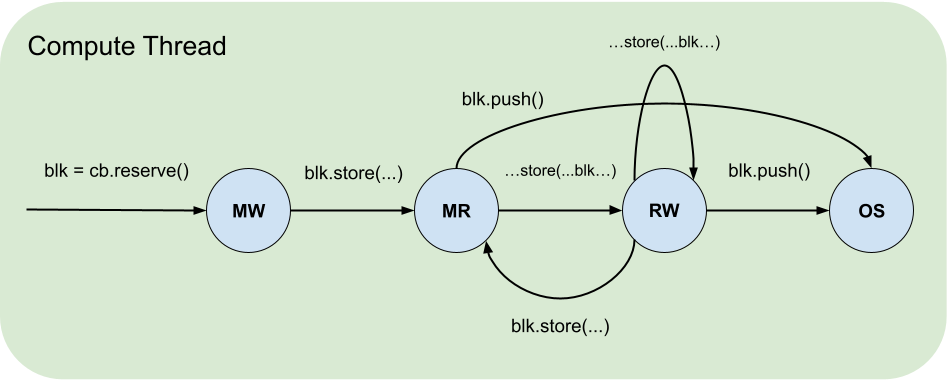
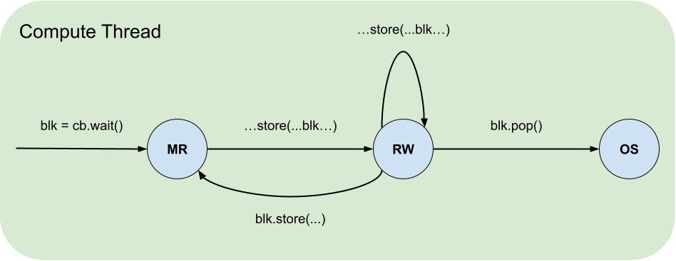

# TT-Lang Specification

* [Specification Versions](#specification-versions)
* [Introduction](#introduction)
* [Operation function](#operation-function)
* [Grid](#grid)
    * [Grid size function](#grid-size-function)
    * [Node function](#node-function)
* [Dataflow buffer](#dataflow-buffer)
* [Block](#block)
    * [Block states](#block-states)
* [Pipe](#pipe)
    * [Pipe net](#pipe-net)
* [Tensor slice](#tensor-slice)
* [Copy](#copy)
    * [Group transfer](#group-transfer)
* [Semaphore](#semaphore)
* [Performance and debugging](#performance-and-debugging)
    * [Profiling signpost](#profiling-signpost)
    * [Debug printing](#debug-printing)
* [Glossary](#appendix-a-glossary)
* [Block operators and math functions](#appendix-b-block-operators-and-math-functions)
* [Naming guidelines](#appendix-c-naming-guidelines)
* [Functionality matrix](#appendix-d-functionality-matrix)
* [Platform limitations](#appendix-e-platform-limitations)


## Specification Versions

| *Version* | *Date* | *Description of changes* |
| :---- | :---- | :---- |
| 0.1 | 12/15/2025 | Initial version |
| 0.2 | 01/20/2026 | Remove `ttl.Program` |
| 0.3 | 01/23/2026 | Add specification for block operators and math functions |
| 0.4 | 01/26/2026 | Add `ttl.block.broadcast` |
| 0.5 | 02/05/2026 | Use dataflow buffer instead of circular buffer term |
| 0.6 | 02/06/2026 | Add rounding, mask, `ttl.block.transpose`, `ttl.block.fill` and `ttl.block.where` functions |
| 0.7 | 02/09/2026 | Move `push` and `pop` from `ttl.DataflowBuffer` to `ttl.Block` |
| 0.8 | 02/09/2026 | Formal block states |
| 0.9 | 03/04/2026 | Add `ttl.GroupTransfer` |
| 0.9 | 03/06/2026 | Add `ttl.signpost` |
| 0.10 | 03/06/2026 | Add debug printing |
| 0.11 | 03/19/2026 | Rename `ttl.core` to `ttl.node` |
| 0.12 | 03/24/2026 | Remove `store(..., acc=True)` |
| 0.13 | 03/31/2026 | Rename `ttl.kernel` to `ttl.operation` |
| 0.14 | 04/02/2026 | Add `ttl.math.abs`, `ttl.math.neg` and `ttl.math.pow` in addition to Python built-in operators. |
| 0.15 | 04/06/2026 | Rename `buffer_factor` to `block_count` |
| 0.16 | 04/22/2026 | Add `ttl.block.squeeze` and `ttl.block.unsqueeze` |
| 0.17 | 04/28/2026 | Move `broadcast`, `transpose`, `where`, `mask`, `mask_posinf`, `fill`, `squeeze`, `unsqueeze` to `ttl.block` |
| 0.18 | 05/15/2026 | Add numeric scalar constants for `ttl.math.reduce_sum` and `ttl.math.reduce_max` scaler arguments, remove shape from arguments |


## Introduction

TT-Lang is a Python based *domain specific language (DSL)* designed to express low-level programs for Tenstorrent hardware. Here the low-level is used to contrast with the high-level programming model represented in [TT-NN](https://docs.tenstorrent.com/tt-metal/latest/ttnn/index.html). Specifically, this means that computation and dataflow *kernels* are programmed separately and need to be explictly syncronized, while TT-NN hides this from the user in its built-in operations. Furthermore, instead of operating on entire tensors, like TT-NN, TT-Lang operates on chunks of tensors called *blocks*, for which the user has to pick the shape to achieve best performance. While based on Python the TT-Lang maintains a number of constraints to what parts of Python can be used in what context, hence the DSL nature of it. The TT-Lang is tightly integrated with TT-NN to provide seamless experience of mixing built-in TT-NN operations and user-written TT-Lang operations in a single program.

In addition to kernels, TT-Lang offers other abstractions familiar to [TT-Metalium](https://docs.tenstorrent.com/tt-metal/latest/tt-metalium/index.html) users such as *dataflow buffers* and *semaphores*. In contrast with TT-Metalium, TT-Lang also offers new, higher level abstractions. In addition to blocks these new abstractions include *tensor slices* and *pipes* that wrap the complexity of dealing with tensor memory layout and node-to-node communication correspondingly.


## Operation function

*Operation function* is a Python function with `ttl.operation` decorator. This function takes input and output [*TT-NN tensors*](https://docs.tenstorrent.com/tt-metal/latest/ttnn/ttnn/tensor.html) as arguments and returns `None`. An operation function contains definitions of *kernel functions* as well as objects shared by all kernel functions. A kernel function is a Python function with no arguments and returning `None` that is annotated by `ttl.compute` or `ttl.datamovement` decorators. The user can call TT-Lang operation function from a TT-NN program and is free to mix it with calling any of the built-in TT-NN operations.

#### Program example

```py
@ttl.operation()
def __foo(
    x: ttnn.Tensor, # input tensor
    y: ttnn.Tensor, # output tensor
) -> None:
    # ...

    @ttl.compute()
    def some_compute():
        # ...

    @ttl.datamovement()
    def some_dm0():
        # ...

    @ttl.datamovement()
    def some_dm1():
        # ...

# Simple wrapper to allow returning output tensor in TT-NN style
def foo(x: ttnn.Tensor) -> ttnn.Tensor:
    y = ttnn.zeros(x.shape, layout=ttnn.TILE_LAYOUT)
    __foo(x, y)
    return y

shape = ttnn.Shape([128, 128])

x = ttnn.rand(shape, layout=ttnn.TILE_LAYOUT)

ttnn.exp(y, foo(ttnn.abs(x)), fast_and_approximate_mode=True)
```


## Grid

A *grid* defines a space of nodes to which the TT-Lang operation is submitted for execution. A node corresponds to a single Tensix Core and is a minimal unit capable of executing a TT-Lang program. In a single-chip case where node-to-node communication is conducted over Network-on-Chip (NoC), the grid is two dimensional. In a multi-chip case where chip-to-chip communication is conduced over TT-Fabric, the grid has additional mesh dimensions representing different levels of connectivity (same card, same host, same rack etc). There is also Single-Program-Multiple-Data (SPMD) mode in which the grid remains two dimensional while the TT-Lang operation is submitted for execution on multiple chips. In SPMD mode TT-Lang operation instances have the same behaviour on different chips while working on different partitions of data, which significantly simplifies reasoning about it. The SPMD functionality is based on [TT-NN Mesh Devices](https://github.com/tenstorrent/tt-metal/blob/main/tech_reports/Programming_Mesh_of_Devices/Programming_Mesh_of_Devices_with_TT-NN.md).


### Grid size function

The `ttl.grid_size` function returns the size of the grid. The function takes an argument that specifies how many dimensions to return. If requested dimensions are smaller than grid dimensions, the highest rank dimension is flattened. If requested dimensions are greater than grid dimensions, highest rank dimensions are padded with a value of one. The `ttl.grid_size` can be used inside an operation function as well as inside kernel functions.

| Type alias/Function | Description |
| :---- | :---- |
| `ttl.PositiveInt = Annotated[int, Gt(0)]` | A positive integer. The metadata `Gt(0)`, can be used by runtime type-checkers to enforce the integer constraints.  |
| `ttl.Size = ttl.PositiveInt` | A size. |
| `ttl.Shape = ttl.Size \| Tuple[ttl.Size, ...]` | A shape type. `ttl.Size` for 1D and tuple of `ttl.Size` otherwise. |
| `ttl.grid_size(dims: ttl.Size) -> ttl.Shape` | Return grid size in specified dimensionality. Returns `ttl.Size` for `dims = 1` and a tuple of `ttl.Size` for other values of dims. |

#### Grid size example

```py
# for (8, 8) single chip or SPMD grid gets x_size = 64
x_size = ttl.grid_size(dims = 1)

# for (8, 8, 8) multi-chip grid gets x_size = 8, y_size = 64
x_size, y_size = ttl.grid_size(dims = 2)

# for (8, 8) single-chip or SPMD grid gets x_size = 8, y_size = 8, z_size = 1
x_size, y_size, z_size = ttl.grid_size(dims = 3)
```


### Node function

The `ttl.node` function returns *node coordinates* of the current node. Node coordinates are zero based and contiguous, which corresponds to a logical indexing scheme. The function takes an argument that specifies how many dimensions to return. If requested dimensions are smaller than grid dimensions, the highest rank dimension is flattened. If requested dimensions are greater than grid dimensions, highest rank dimensions are padded with a value of zero. The `ttl.node` can be used inside an operation function as well as inside kernel functions.

| Type alias/Function | Description |
| :---- | :---- |
| `ttl.NaturalInt = Annotated[int, Ge(0)]` | Non-negative integer. The metadata `Ge(0)`, can be used by runtime type-checkers to enforce the integer constraints. |
| `ttl.Index = ttl.NaturalInt` | An index, assumes non-negative indexes. |
| `ttl.NodeCoord = ttl.Index \| Tuple[ttl.Index, ...]` | Node coordinates. `ttl.Index` for 1D and tuple of `ttl.Index` otherwise. |
| `ttl.node(dims: ttl.Index) -> ttl.NodeCoord` | Return node coordinates in specified dimensionality. Returns `ttl.Index` for `dims = 1` and a tuple of `ttl.Index` for other values of dims. |

#### Node example

```py
# for (8, 8) single chip or SPMD grid gets x = [0, 64)
x = ttl.node(dims = 1)

# for (8, 8, 8) multi-chip grid gets x = [0, 8), y = [0, 64)
x, y = ttl.node(dims = 2)

# for (8, 8) single-chip or SPMD grid gets x = [0, 8), y = [0, 8), z = 0
x, y, z = ttl.node(dims = 3)
```


## Dataflow buffer

A *dataflow buffer* is a communication primitive for synchronizing the passing of data between kernel functions running on the same node. A dataflow buffer is created with the `ttl.make_dataflow_buffer_like` function by passing TT-NN tensor, *shape* and *block count*.

The shape is expressed as a tuple with outermost dimension first and innermost dimension last. For `ttl.math` functions that take dimension indexes, the outermost dimension is indexed as 0, next to outermost as 1. It is possible to use negative dimension indexes to index from innermost dimension. This way the innermost dimension is indexed as -1, next to innermost as -2. The TT-NN tensor determines basic properties (likeness) such as data type and *shape unit*. Shape unit can be either a tile (32 by 32 scalar elements) or a scalar element. In order for block to be used with tiled tensor, it needs to have at least two dimensions (see example below). In this case, the translation from Torch shape affects two innermost dimensions. For example, if a TT-NN tensor is of tiled layout and has Torch shape of `(2, 2, 120, 30)`, the corresponding block that fits this entire tensor will have shape of `(2, 2, 4, 1)`.

#### Tiled tensor shape example

```py
def from_torch(tensor: torch.Tensor) -> ttnn.Tensor:
    return ttnn.from_torch(
        tensor,
        layout=ttnn.TILE_LAYOUT,
        device=device,
    )

def shape_in_tiles(tensor: ttnn.Tensor) -> list[int]:
    padded_shape = list(tensor.padded_shape)
    tile_shape = list(tensor.tile.tile_shape)
    return padded_shape[:-2] + [dim // tile_dim for dim, tile_dim in zip(padded_shape[-2:], tile_shape)]

shape_in_tiles(from_torch(torch.randn(()))) #              prints [1, 1]
shape_in_tiles(from_torch(torch.randn((128)))) #           prints [1, 4]
shape_in_tiles(from_torch(torch.randn((1, 128)))) #        prints [1, 4]
shape_in_tiles(from_torch(torch.randn((32, 128)))) #       prints [1, 4]
shape_in_tiles(from_torch(torch.randn((128, 1)))) #        prints [4, 1]
shape_in_tiles(from_torch(torch.randn((128, 32)))) #       prints [4, 1]
shape_in_tiles(from_torch(torch.randn((2, 128, 32)))) #    prints [2, 4, 1]
shape_in_tiles(from_torch(torch.randn((2, 2, 128, 32)))) # prints [2, 2, 4, 1]
shape_in_tiles(from_torch(torch.randn((2, 2, 120, 30)))) # prints [2, 2, 4, 1]
```

If tensor has a row-major layout the shape unit is a scalar element. For the TT-NN tensor with Torch shape of `(2, 2, 120, 30)` the corresponding block that fits this entire tensor will have shape of `(2, 2, 120, 30)`.

#### Row-major tensor shape example

```py
def from_torch(tensor: torch.Tensor) -> ttnn.Tensor:
    return ttnn.from_torch(
        tensor,
        layout=ttnn.ROW_MAJOR_LAYOUT,
        device=device,
    )

def row_major_shape(tensor: ttnn.Tensor) -> list[int]:
    return list(tensor.padded_shape)

row_major_shape(from_torch(torch.randn(()))) #              prints [1]
row_major_shape(from_torch(torch.randn((128)))) #           prints [128]
row_major_shape(from_torch(torch.randn((1, 128)))) #        prints [1, 128]
row_major_shape(from_torch(torch.randn((32, 128)))) #       prints [32, 128]
row_major_shape(from_torch(torch.randn((128, 1)))) #        prints [128, 1]
row_major_shape(from_torch(torch.randn((128, 32)))) #       prints [128, 32]
row_major_shape(from_torch(torch.randn((2, 128, 32)))) #    prints [2, 128, 32]
row_major_shape(from_torch(torch.randn((2, 2, 128, 32)))) # prints [2, 2, 128, 32]
row_major_shape(from_torch(torch.randn((2, 2, 120, 30)))) # prints [2, 2, 120, 30]
```

Shape determines the shape of a *block* returned by one of the *acquisition functions*: `wait` and `reserve`. The size of a block in L1 memory is determined by shape, shape unit and data type. For example, for a block with shape `(2, 2, 4, 1)`, shape unit of a tile (32 by 32 scalar elements) and BF16 data type (2 bytes), its size in L1 will be `2 * 2 * (4 * 32) * (1 * 32) * 2 = 32768` bytes. The block count determines the total size of L1 memory allocated for a dataflow buffer. This size is a product of a block size and block count. For the most common case block count defaults to 2 to support double buffering. With double buffered dataflow buffer one kernel can write to a block while another is reading from a block thus enabling the pipelining. For the example above, this means there will be a total of 32768 bytes of L1 memory allocated for the dataflow buffer.

A dataflow buffer is constructed in the scope of an operation function but its object functions can only be used inside of kernel functions. Acquisition functions can be used with Python `with` statement, which will automatically release acquired blocks at the end of the `with` scope. Alternatively, if acquisition functions are used without the `with` the user must explicitly call a corresponding release function on the acquired block: `pop` for `wait` and `push` for `reserve`.

#### Dataflow buffer example

```py
x_dfb = ttl.make_dataflow_buffer_like(x,
    shape = (2, 2),
    block_count = 2) # This can be omitted since block_count defaults to 2

@ttl.datamovement()
def some_read():
    # Reserve x_blk from x_dfb
    with x_dfb.reserve() as x_blk:

        # Load data into x_blk
        # ...

        # Push x_blk implicitly at the end of the "with" scope

@ttl.compute()
def some_compute():
    # Wait for x_blk from x_dfb
    x_blk = x_dfb.wait()

    # Consume data in x_blk
    # ...

    x_blk.pop() # Pop x_blk explicitly
```

| Type alias/Function | Description |
| :---- | :---- |
|  `ttl.make_dataflow_buffer_like(ttnn.Tensor: likeness_tensor, shape: ttl.Shape, block_count: ttl.Size = 2) -> ttl.DataflowBuffer` | Create a dataflow buffer by inheriting basic properties from `likeness_tensor`. |
|  `ttl.DataflowBuffer.reserve(self) -> ttl.Block` | Reserve and return a block from a dataflow buffer. **This function is blocking** and will wait until a *free* block is available. A free block is typically used by a producer to write the data into. |
| `ttl.Block.push(self)` | Push a block to a dataflow buffer. This function is called by the producer to signal the consumer that a block *filled* with data is available. **This function is non-blocking.** |
| `ttl.DataflowBuffer.wait(self) -> ttl.Block` | Wait for and return a block from a dataflow buffer. **This function is blocking** and will wait until a block filled with data is available. A filled block is typically used by a consumer to read data from. |
| `ttl.Block.pop(self)` | Pop a block from a dataflow buffer. This function is called by the consumer to signal the producer that block is free and available. **This function is non-blocking.** |


## Block

A *block* represents memory acquired from a dataflow buffer. Block size is determined by the shape of a dataflow buffer and its memory is allocated when a dataflow buffer is created. Inside of a compute kernel a block can participate in a *block expression* with built-in Python operators and TT-Lang math functions as an operand. A block can also be a storage for the result of block expression by using `store` function. Inside of data movement kernels a block can participate in `ttl.copy` as a source or a destination.

#### Tiled element-wise with broadcast and reduce example

```py
# ---------------------
# Tiled element-wise with broadcast and reduce:
#
# y[n] = ∑(√(a[n, m]² + b[n]² + c[m]² + d²))
#        j
#
# z[m] = ∑(√(a[n, m]² - b[n]² - c[m]² - d²))
#        i
#
# Tensor   Torch shape   Note
# a        N, M          N >> M
# b        N, 1          Column-wise vector — broadcast to match a along M
# c        M             Row-wise vector — broadcast to match a along N
# d        ()            Scalar value — broadcast to match a along N and M
# y        N, 1
# z        M
#
# All tensors have tiled layout

# Shape in tiles (N and M are evenly divisible by TILE_SIZE)
N_TILES = N // TILE_SIZE
M_TILES = M // TILE_SIZE

# Shape in blocks (N_TILES is evenly divisible by N_BLOCK_SIZE)
N_BLOCKS = N_TILES // N_BLOCK_SIZE

a_dfb = ttl.make_dataflow_buffer_like(a, shape = (N_BLOCK_SIZE, M_TILES))

# Tiled DFB shape needs to be at least two-dimensional;
# When tiled, the vector b of shape (N, 1) is placed in column 0
# of each tile in a column of N_TILES tiles
b_dfb = ttl.make_dataflow_buffer_like(b, shape = (N_BLOCK_SIZE, 1))
# When tiled, the vector c of shape M is placed in row 0
# of each tile in a row of M_TILES tiles
c_dfb = ttl.make_dataflow_buffer_like(c, shape = (1, M_TILES))
# When tiled, the scalar value d of shape () is placed at position (0, 0)
# of a single tile
d_dfb = ttl.make_dataflow_buffer_like(d, shape = (1, 1))
# When untiled, the vector y is formed from column 0
# of each tile in a column of N_TILES tiles
y_dfb = ttl.make_dataflow_buffer_like(y, shape = (N_BLOCK_SIZE, 1))
# When untiled, the vector z is formed from row 0
# of each tile in a row of M_TILES tiles
z_dfb = ttl.make_dataflow_buffer_like(z, shape = (1, M_TILES))

@ttl.datamovement()
def elwise_read():

    # Reserve c_blk and d_blk blocks
    with (
        c_dfb.reserve() as c_blk,
        d_dfb.reserve() as d_blk,
    ):
        # Load entire (1×M_TILES) of c;
        # When tiled, the vector c of shape M is placed in row 0
        # of each tile in a row of M_TILES tiles
        c_xf = ttl.copy(c[0, :], c_blk)

        # Load entire (1×1) d;
        # When tiled, the scalar value d of shape () is placed at position (0, 0)
        # of a single tile
        d_xf = ttl.copy(d[0, 0], d_blk)

        c_xf.wait()
        d_xf.wait()

        # End of "with" scope:
        # Push c_blk and d_blk to make them ready for elwise_compute

    for n_block in range(N_BLOCKS):

        # Reserve a_blk and b_blk blocks
        with (
            a_dfb.reserve() as a_blk,
            b_dfb.reserve() as b_blk,
        ):
            # Load N_BLOCK_SIZE×M_TILES block of a
            a_xf = ttl.copy(a[n_block * N_BLOCK_SIZE : (n_block + 1) * N_BLOCK_SIZE, :], a_blk)

            # Load N_BLOCK_SIZE×1 block of b;
            # When tiled, the vector b of shape (N, 1) is placed in column 0
            # of each tile in a column of N_TILES tiles
            b_xf = ttl.copy(b[n_block * N_BLOCK_SIZE : (n_block + 1) * N_BLOCK_SIZE, 0], b_blk)

            a_xf.wait()
            b_xf.wait()

            # End of "with" scope:
            # Push a_blk and b_blk to make them ready for elwise_compute

@ttl.compute()
def elwise_compute():

    # Wait for c_blk and d_blk to be loaded and pushed by elwise_read;
    # Reserve z_blk
    with (
        c_dfb.wait() as c_blk,
        d_dfb.wait() as d_blk,
        z_dfb.reserve() as z_blk,
    ):
        c_squared = c_blk ** 2
        d_squared = d_blk ** 2

        # Broadcast c_squared along dimension 0 (first) to get N_BLOCK_SIZE×M_TILES;
        # This first broadcasts column 0 to fill each of M_TILES tiles
        # then it broadcasts column of M_TILES tiles to get N_BLOCK_SIZE×M_TILES tiles
        c_squared_bcast = ttl.block.broadcast(c_squared, dims=[0], shape=(N_BLOCK_SIZE, M_TILES))

        # Broadcast d_squared along all dimensions (0 and 1) to N_BLOCK_SIZE×M_TILES;
        # This first broadcasts single scalar value at position (0, 0) to fill a single tile
        # then it broadcasts single tile to get N_BLOCK_SIZE×M_TILES tiles
        d_squared_bcast = ttl.block.broadcast(d_squared, dims=[0, 1], shape=(N_BLOCK_SIZE, M_TILES))

        # Zero-initialize the accumulator z before summing N_BLOCKS partial sums
        z_final = ttl.block.fill(0, shape=(1, M_TILES))

        for _ in range(N_BLOCKS):

            # Wait for a_blk and b_blk to be loaded and pushed by elwise_read;
            # Reserve y_blk
            with (
                a_dfb.wait() as a_blk,
                b_dfb.wait() as b_blk,
                y_dfb.reserve() as y_blk,
            ):
                a_squared = a_blk ** 2
                b_squared = b_blk ** 2

                # Broadcast b_squared along dim -1 (last) to get N_BLOCK_SIZE×M_TILES;
                # This first broadcasts row 0 to fill each of N_BLOCK_SIZE tiles
                # then it broadcasts row of N_BLOCK_SIZE tiles to get N_BLOCK_SIZE×M_TILES tiles
                b_squared_bcast = ttl.block.broadcast(b_squared, dims=[-1], shape=(N_BLOCK_SIZE, M_TILES))

                # Perform elementwise math on N_BLOCK_SIZE×M_TILES tiles
                expanded_y = ttl.math.sqrt(a_squared + b_squared_bcast + c_squared_bcast + d_squared_bcast)
                expanded_z = ttl.math.sqrt(a_squared - b_squared_bcast - c_squared_bcast - d_squared_bcast)

                # Reduce expanded_y along dim -1 (last) to get N_BLOCK_SIZE×1 row of tiles
                y_final = ttl.math.reduce_sum(expanded_y, dims=[-1], shape=(N_BLOCK_SIZE, 1))

                # Reduce expanded_z along dim 0 (first) to get 1×M_TILES column of tiles;
                z_partial = ttl.math.reduce_sum(expanded_z, dims=[0], shape=(1, M_TILES))

                # Store y_final
                y_blk.store(y_final)

                # Accumulate-add partial z_final
                z_final += z_partial

                # End of "with" scope:
                # Pop a_blk and b_dfb to make them available for elwise_read to load and push next blocks;
                # Push y_blk to make it ready for elwise_write

        # Store z_final
        z_blk.store(z_final)

        # End of "with" scope:
        # Pop c_blk and d_blk;
        # Push z_blk to make it ready for elwise_write

@ttl.datamovement()
def elwise_write():

    # Wait for elwise_compute to store and push z_blk
    with z_dfb.wait() as z_blk:

        # Store entire (1xM_TILES) of z;
        # When untiled, the vector z is formed from row 0
        # of each tile in a row of M_TILES tiles
        z_xf = ttl.copy(z_blk, z[0, :])
        z_xf.wait()

        # End of "with" scope:
        # Pop z_blk

    for n_block in range(N_BLOCKS):
        n_slice = slice(n_block * N_BLOCK_SIZE, (n_block + 1) * N_BLOCK_SIZE)

        # Wait for elwise_compute to store and push y_blk
        with y_dfb.wait() as y_blk:

            # Store N_BLOCK_SIZExM_TILES of y;
            # When untiled, the vector y is formed from column 0
            # of each tile in a column of N_TILES tiles
            y_xf = ttl.copy(y_blk, y[n_slice, :])
            y_xf.wait()

            # End of "with" scope:
            # Pop y_blk to make it available for elwise_compute to store and push next block

```

#### Batched matrix multiplication with bias example

```py
# ---------------------
# Batched matrix multiplication with bias:
#
# y[i, m, n] = ∑(a[i, m, k] * b[k, n]) + c[m, n]
#              k
#
# Tensor   Torch shape   Note
# a        I, M, K       Batched a matrix (e.g. input activations)
# b        K, N          Non-batched b matrix (e.g. weights)
# c        M, N          Non-batched bias matrix c (e.g. weights)
# y        I, M, N       Batched y matrix (e.g. output activations)
#
# All tensors have tiled layout

# Shape in tiles (I, M, N and K are evenly divisible by TILE_SIZE)
I_TILES = I // TILE_SIZE
M_TILES = M // TILE_SIZE
N_TILES = N // TILE_SIZE
K_TILES = K // TILE_SIZE

# Shape in blocks (I_TILES, M_TILES, N_TILES and K_TILES are evenly
# divisible by I_BLOCK_SIZE, M_BLOCK_SIZE, N_BLOCK_SIZE and K_BLOCK_SIZE)
I_BLOCKS = I_TILES // I_BLOCK_SIZE
M_BLOCKS = M_TILES // M_BLOCK_SIZE
N_BLOCKS = N_TILES // N_BLOCK_SIZE
K_BLOCKS = K_TILES // K_BLOCK_SIZE

a_dfb = ttl.make_dataflow_buffer_like(a, shape = (I_BLOCK_SIZE, M_BLOCK_SIZE, K_BLOCK_SIZE))
b_dfb = ttl.make_dataflow_buffer_like(b, shape = (K_BLOCK_SIZE, N_BLOCK_SIZE))
c_dfb = ttl.make_dataflow_buffer_like(c, shape = (M_BLOCK_SIZE, N_BLOCK_SIZE))
y_dfb = ttl.make_dataflow_buffer_like(y, shape = (I_BLOCK_SIZE, M_BLOCK_SIZE, N_BLOCK_SIZE))

@ttl.datamovement()
def matmul_read():
    for i_block in range(I_BLOCKS):
        i_slice = slice(i_block * I_BLOCK_SIZE, (i_block + 1) * I_BLOCK_SIZE)

        for m_block in range(M_BLOCKS):
            m_slice = slice(m_block * M_BLOCK_SIZE, (m_block + 1) * M_BLOCK_SIZE)

            for n_block in range(N_BLOCKS):
                n_slice = slice(n_block * N_BLOCK_SIZE, (n_block + 1) * N_BLOCK_SIZE)

                # Reserve c_blk
                with c_dfb.reserve() as c_blk:

                    # Load M_BLOCK_SIZE×N_BLOCK_SIZE block of c into c_blk
                    c_xf = ttl.copy(c[m_slice, n_slice], c_blk)
                    c_xf.wait()

                    # End of "with" scope:
                    # Push c_blk to make it ready for matmul_compute

                # Repeat for each K block
                for k_block in range(K_BLOCKS):
                    k_slice = slice(k_block * K_BLOCK_SIZE, (k_block + 1) * K_BLOCK_SIZE)

                    # Reserve a_blk and b_blk
                    with (
                        a_dfb.reserve() as a_blk,
                        b_dfb.reserve() as b_blk,
                    ):
                        # Load I_BLOCK_SIZE×M_BLOCK_SIZE×K_BLOCK_SIZE of a into a_blk
                        # and K_BLOCK_SIZE×N_BLOCK_SIZE of b into b_blk
                        a_xf = ttl.copy(a[i_slice, m_slice, k_slice], a_blk)
                        b_xf = ttl.copy(b[k_slice, n_slice], b_blk)

                        a_xf.wait()
                        b_xf.wait()

                        # End of "with" scope:
                        # Push a_blk and b_blk to make it ready for matmul_compute

@ttl.compute()
def matmul_compute():
    for _ in range(I_BLOCKS):
        for _ in range(M_BLOCKS):
            for _ in range(N_BLOCKS):

                # Reserve y_blk
                with y_dfb.reserve() as y_blk:

                    # Zero-initialize the accumulator y_final before summing K_BLOCKS partial products
                    y_final = ttl.block.fill(0, shape=(I_BLOCK_SIZE, M_BLOCK_SIZE, N_BLOCK_SIZE))

                    # Repeat for each K block
                    for _ in range(K_BLOCKS):

                        # Wait for a_blk and b_blk to be loaded and pushed by matmul_read
                        with (
                            a_dfb.wait() as a_blk,
                            b_dfb.wait() as b_blk,
                        ):
                            # b_blk has shape K_BLOCK_SIZE×N_BLOCK_SIZE;
                            # Unsqueeze it to 1×K_BLOCK_SIZE×N_BLOCK_SIZE and then
                            # broadcast it over dim 0 to I_BLOCK_SIZE×K_BLOCK_SIZE×N_BLOCK_SIZE
                            b_bcast = ttl.block.broadcast(ttl.block.unsqueeze(b_blk, dims=[0]), dims=[0], shape=(I_BLOCK_SIZE, K_BLOCK_SIZE, N_BLOCK_SIZE))

                            # Accumulate dot product between I_BLOCK_SIZE×M_BLOCK_SIZE×K_BLOCK_SIZE a_blk and
                            # I_BLOCK_SIZE×K_BLOCK_SIZE×N_BLOCK_SIZE b_bcast in y_final
                            y_final += a_blk @ b_bcast

                            # End of "with" scope:
                            # Pop a_blk and b_blk to make them available for matmul_read to load and push next blocks

                    # Wait for c_blk to be loaded and pushed by matmul_read
                    with c_dfb.wait() as c_blk:

                        # c_blk has shape M_BLOCK_SIZE×N_BLOCK_SIZE;
                        # Unsqueeze it to 1×M_BLOCK_SIZE×N_BLOCK_SIZE and then
                        # broadcast it over dim 0 to I_BLOCK_SIZE×M_BLOCK_SIZE×N_BLOCK_SIZE
                        c_bcast = ttl.block.broadcast(ttl.block.unsqueeze(c_blk, dims=[0]), dims=[0], shape=(I_BLOCK_SIZE, M_BLOCK_SIZE, N_BLOCK_SIZE))

                        y_final = y_final + c_bcast

                        # End of "with" scope:
                        # Pop c_blk to make it available for matmul_read to load and push next block

                    y_blk.store(y_final)

                    # End of "with" scope:
                    # Push y_blk to make it ready for matmul_write

@ttl.datamovement()
def matmul_write():
    for i_block in range(I_BLOCKS):
        for m_block in range(M_BLOCKS):
            for n_block in range(N_BLOCKS):

                # Wait for matmul_compute to store and push y_blk
                with y_dfb.wait() as y_blk:

                    # Store I_BLOCK_SIZE×M_BLOCK_SIZE×N_BLOCK_SIZE y_blk block into y
                    y_xf = ttl.copy(y_blk, y[
                        i_block * I_BLOCK_SIZE : (i_block + 1) * I_BLOCK_SIZE,
                        m_block * M_BLOCK_SIZE : (m_block + 1) * M_BLOCK_SIZE,
                        n_block * N_BLOCK_SIZE : (n_block + 1) * N_BLOCK_SIZE])
                    y_xf.wait()

                    # End of "with" scope:
                    # Pop y_blk to make it available for matmul_compute to store and push next block
```

| Function | Description |
| :---- | :---- |
| `ttl.Block.store(self, expr: ttl.BlockExpr)` | This function materializes the result of a *block expression* and stores it in the block. Block expression uses Python builtin math operators and `ttl.math.xxx` functions on block expression. **This function is blocking** so that block is safe to use immediately after the call. |

For `ttl.math` functions and block operators see [Appendix B](#appendix-b-block-operators-and-math-functions).


## Block states

Blocks have a life cycle that starts with acquisition by using dataflow buffer's `reserve` or `wait` functions and ends with release by block's `push` and `pop` functions correspondingly. During this life cycle there are restrictions on what operations and in what sequences a block can participate in. These restrictions are formalized by the table below, which summarizes the states, and the accompanying diagrams, which illustrate the legal transitions.

| Block State | Description |
| :---- | :---- |
| **MW** | **Must be Written**: the block was reserved and contains garbage data and therefore must be written to. |
| **MR** | **Must be Read**: the block was waited on or written to and never read and therefore must be read from or pushed. |
| **RW** | **Read-Write**: the block was waited on or written to (MR) and then read from and therefore can be either read from more times or overwritten. |
| **ROR(N)** | **Read Only while Reading**: the block is being asynchronously read from by **N** `ttl.copy`s. |
| **NAW** | **No Access while Writing**: the block is being asynchronously written to. |
| **OS** | **Out of Scope**: the block was pushed or popped. |






## Pipe

A *pipe* is a communication primitive for organizing the passing of data between data movement kernels on different nodes. A pipe is used as a source or a destination in the `ttl.copy`. The pipe is constructed with source node coordinate (`src`) and destination (`dst`), which is either a single node coordinate for unicast or *node range* for multicast. The node range uses a combination of dimension slices and values to describe a contiguous hypercube.

A node range has the same number of dimensions as `grid_size(dims=N)`, and each coordinate `c_i` lies within the corresponding grid extent `G_i` (i.e. `0 <= c_i < G_i`). The range may be smaller than the grid: pipes are not required to span every node along any dimension.

The *launch extent* of an operation is the grid on which the operation is launched, selected by the `grid=` argument of `@ttl.operation(grid=...)`. Pipe coordinates need not span the launch extent: they describe only the nodes that participate as pipe sources or destinations, that is, the operation's *active set* (defined under [Pipe net](#pipe-net) below).

For example, consider an operation on a device with a 4x4 compute grid whose pipe sources and destinations together cover at most a 2x3 region: its active set has at most 6 nodes. Under `grid="full"` it launches on all 16 nodes; every node outside the active set must be guarded out of the pipe-coupled regions by the user.

The launch extent is selected by the value passed to `grid=`:

| Value | Launch extent |
| :---- | :---- |
| `"full"` | The device compute grid, regardless of pipe coordinates. |
| Tuple | Used verbatim. |
| `"auto"` (future) | Currently the same as `"full"`. In future may provide grid-sizing-related optimizations. |

Whenever the launch extent is wider than the active set (which is always the case under `"full"` or any explicit tuple, and also currently under `"auto"`), the user must guard pipe-coupled regions with `net.is_src()` / `net.is_dst()` / `net.is_active()` (or equivalent coordinate predicates) so that nodes outside the corresponding role skip the pipe-coupled work.

| Type alias/Function | Description |
| :---- | :---- |
| `ttl.NodeRange = Tuple[ttl.Index \| slice, ...]` | A node range. |
| `ttl.Pipe[DstT](src: ttl.NodeCoord, dst: DstT) -> ttl.Pipe[DstT]` | Constructs pipe description to be used to construct pipe net. The `dst` argument is of `DstT` type, which can be either `ttl.NodeCoord` or `ttl.NodeRange`. |


### Pipe net

A *pipe net* is a communication primitive that groups pipes into a network. A pipe net is constructed from a list of pipes and encapsulates all necessary information to determine if a given node is source, destination or both and where and from which node or nodes the corresponding transfers will occur. Pipe net object has two functions: `if_src` and `if_dst`. Both functions have a single argument: *condition body function*.

Condition body function is invoked for each pipe in case of `if_src` if the current node is a source, and in case of `if_dst` if the current node is a destination. The condition body function has a single argument: a pipe identity that satisfies the condition. Condition body function can identify the source and the destination by its `src` and `dst` read-only properties correspondingly.

A pipe net is constructed either in the scope of an operation function or in an enclosing scope and captured by the operation function. It can only be used with its `if_src` and `if_dst` functions inside of a data movement kernel function. The corresponding  `ttl.copy` where a pipe is a source or a destination can be called only inside of a condition body function. Calls into `if_src` and `if_dst` can be nested within condition functions for different pipe nets.

The *active set* of an operation is the union, over every pipe in every pipe net in scope of the operation (constructed in its body or captured from an enclosing scope), of the pipe's source coordinate and its destination coordinate or range. The *role domain* of a pipe net is its per-net active set; `pipe_net.is_src()`, `pipe_net.is_dst()`, and `pipe_net.is_active()` are predicates that evaluate to `True` on the source role, destination role, and their union, respectively.
The active predicates are only required for code that includes pipe-coupled computations. Any non-pipe-related code segment can execute on all nodes of the operation's grid or have its own guards that are independent of pipes.

| Function | Description |
| :---- | :---- |
| `ttl.PipeNet[DstT](pipes: List[ttl.Pipe[DstT]]) -> ttl.PipeNet[DstT]` | Constructs pipe net. |
| `ttl.PipeNet[DstT].if_src(self, cond_fun: Callable[[ttl.SrcPipeIdentity[DstT]], None])` | Call condition function for each pipe in the pipe net that is a source. |
| `ttl.PipeNet[DstT].if_dst(self, cond_fun: Callable[[ttl.DstPipeIdentity], None])` | Call condition function for each pipe in the pipe net that is a destination. |
| `ttl.PipeNet[DstT].is_src(self) -> bool` | Predicate: `True` on the current node if and only if it is a source coordinate of any pipe in the pipe net. |
| `ttl.PipeNet[DstT].is_dst(self) -> bool` | Predicate: `True` on the current node if and only if it is in the destination range of any pipe in the pipe net. |
| `ttl.PipeNet[DstT].is_active(self) -> bool` | Predicate: `True` on the current node if and only if `is_src()` or `is_dst()` is `True`. |
| `@property ttl.SrcPipeIdentity[DstT].dst(self) -> DstT` | Get destination node or node range for pipe in `if_src`. |
| `@property ttl.DstPipeIdentity.src(self) -> ttl.NodeCoord` | Get source node for pipe in `if_dst`. |


#### Gather example

```py
# Grid:
#
# column
# x == 0
#   |
#   V
# (0, 0) (1, 0) (2, 0) (3, 0) <-- row y == 0
# (0, 1) (1, 1) (2, 1) (3, 1)
# (0, 2) (1, 2) (2, 2) (3, 2)
# (0, 3) (1, 3) (2, 3) (3, 3)

# ---------------------
# gather from row y to (0, y) with unicast.
#
# The pipe net is sized from the active set, not the launch extent.
# ROWS and COLS describe the rectangle that bounds the active set.
# Nodes outside the active rectangle (row 0..ROWS-1, column 0..COLS-1)
# skip the kernel body.

ROWS = ...  # rows participating in the gather
COLS = ...  # columns participating in the gather

net = ttl.PipeNet([ttl.Pipe(
    src = (x, y),
    dst = (0, y)) for x in range(1, COLS) for y in range(ROWS)])

# (1, 0) -> (0, 0) |             |
# (2, 0) -> (0, 0) | sequential  |
# (3, 0) -> (0, 0) |             |
# ...              |             | concurrent
#                                |
# (1, 1) -> (0, 1)               |
# ...                            |

@ttl.datamovement()
def dm():
    with dfb.reserve() as blk:

        def pipe_src(pipe):

            # write data into blk
            # ...

            # then copy blk to pipe:

            xf = ttl.copy(blk, pipe)
            xf.wait()

        def pipe_dst(pipe):

            # copy blk from pipe:

            xf = ttl.copy(pipe, blk)
            xf.wait()

            # then read data from blk
            # ...

        net.if_src(pipe_src)
        net.if_dst(pipe_dst)
```

#### Scatter example

```py
# ---------------------
# scatter from (x, 0) to column x with multicast

grid_x, grid_y = ttl.grid_size()

net = ttl.PipeNet([ttl.Pipe(
    src = (x, 0),
    dst = (x, slice(1, grid_y))) for x in range(grid_x)])

# (0, 0) => (0, 1) (0, 2) (0, 3) ... |
# (1, 0) => (1, 1) (1, 2) (1, 3) ... | concurrent
# ...                                |

@ttl.datamovement()
def dm():
    with dfb.reserve() as blk:

        def pipe_src(pipe):

            # write data into blk
            # ...

            # then copy blk to pipe:

            xf = ttl.copy(blk, pipe)
            xf.wait()

        def pipe_dst(pipe):

            # copy blk from pipe:

            xf = ttl.copy(pipe, blk)
            xf.wait()

            # then read data from blk
            # ...

        net.if_src(pipe_src)
        net.if_dst(pipe_dst)
```

#### Scatter-gather example

```py
# ---------------------
# scatter-gather column x with multicast/loopback

grid_x, grid_y = ttl.grid_size()

net = ttl.PipeNet([ttl.Pipe(
    src = (x, y),
    dst = (x, slice(0, grid_y))) for x in range(grid_x) for y in range(grid_y)])

# (0, 0) => (0, 0) (0, 1) (0, 2) ... |            |
# (0, 1) => (0, 0) (0, 1) (0, 2) ... | sequential |
# (0, 2) => (0, 0) (0, 1) (0, 2) ... |            |
# ...                                |            | concurrent
#                                                 |
# (1, 0) => (1, 0) (1, 1) (1, 2) ...              |
# ...                                             |

@ttl.datamovement()
def dm():
    with dfb.reserve() as blk:

        def pipe_src(pipe):

            # write data into blk
            # ...

            # then copy blk to pipe:

            xf = ttl.copy(blk, pipe)
            xf.wait()

        def pipe_dst(pipe):

            # copy blk from pipe:

            xf = ttl.copy(pipe, blk)
            xf.wait()

            # then read data from blk
            # ...

        net.if_src(pipe_src)
        net.if_dst(pipe_dst)
```

#### Forward to a \+1 neighbor example

```py
# ---------------------
# forward to a +1 neighbor in a column x

grid_x, grid_y = ttl.grid_size()

net = ttl.PipeNet([ttl.Pipe(
    src = (x, y),
    dst = (x, (y + 1) % grid_y)) for x in range(grid_x) for y in range(grid_y)])

# (0, 0) => (0, 1)  |
# (0, 1) => (0, 2)  |
# ...               |
# (0, 7)* => (0, 0) |
# ...               | concurrent
#                   |
# (1, 0) => (1, 1)  |
# ...               |
#
# * - assuming (8, 8) grid

@ttl.datamovement()
def dm():

    with (
        dfb_to_send.reserve() as blk_to_send,
        dfb_received.reserve() as blk_received,
    ):

        def pipe_src(pipe):

            # write data into blk_to_send
            # ...

            # then copy blk_to_send to pipe:

            xf = ttl.copy(blk_to_send, pipe)
            xf.wait()

        def pipe_dst(pipe):

            # copy blk_received from pipe:

            xf = ttl.copy(pipe, blk_received)
            xf.wait()

            # then read data from blk_received
            # ...

        net.if_src(pipe_src)
        net.if_dst(pipe_dst)
```


## Tensor slice

A *tensor slice* is a view into a TT-NN tensor defined in terms of a dimension slice or value for each of the tensor's dimensions. A tensor slice can participate in `ttl.copy` as a source or a destination with the corresponding destination and source being a block. Tensor slice can only be used in the scope of a data movement kernel function.

| Function | Description |
| :---- | :---- |
| `ttnn.Tensor.__getitem__(self, *index: ttl.Index \| slice) -> ttl.TensorSlice` | Get a tensor slice from a TT-NN tensor. |

#### Tensor slice example

```py
g = 2 # granularity
a_dfb = ttl.make_dataflow_buffer_like(A, shape = (g, 1))

row_tiles = A.shape[0] // ttl.TILE_SHAPE[0]
col_tiles = A.shape[1] // ttl.TILE_SHAPE[1]
cols_per_node = math.ceil(col_tiles / (grid_size(dims = 1)))

node_num = ttl.node(dims = 1)
start_ct = node_num * cols_per_node
end_ct = min(start_ct + cols_per_node, col_tiles)

@ttl.datamovement()
def dm():
    for ct in range(start_ct, end_ct):
        for rt in range(row_tiles // g):

            # acquire a_blk from a_dfb:

            with a_dfb.reserve() as a_blk:

                # then copy from a tensor slice of matching shape:

                row_slice = slice(rt * g, (rt + 1) * g) # explicit row slice
                a_xf = ttl.copy(
                    A[row_slice, ct:ct + 1], # in-line col slice
                    a_blk)
                a_xf.wait()
```


## Copy

The `ttl.copy` function expresses a variety of data movements that always have two arguments: source and destination. `ttl.copy` returns a *transfer handle* object. A transfer handle has a `wait` function that serves as a barrier. When the `wait` returns the transfer is complete and data in the destination is safe to use.  The `ttl.copy` can only be used inside of a data movement kernel function.


### Group transfer

When `ttl.copy` function is called multiple times, instead of waiting on each transfer handle, it is possible to group handles and wait on all handles at once. This is done by instantiating `ttl.GroupTransfer` object and then adding handles with its `add` function. Once all handles are added `wait_all` function is called to wait for all transfers to complete.

#### Group transfer example

```py
# ---------------------
# Nearest Neighbor Upsample
#
# Tensor              Torch shape
# input_images        N, HI, WI, C
# output_images       N, HO, WO, C
#
# All tensors have row-major layout

HO = HI * H_SCALE_FACTOR
WO = WI * W_SCALE_FACTOR

io_dfb = ttl.make_dataflow_buffer_like(
    input_images, shape=(C,), block_count=2
)

@ttl.datamovement()
def reader():
    for n in range(N):
        for hi in range(HI):
            for wi in range(WI):
                with io_dfb.reserve() as io_blk:

                    # Load input pixel channels

                    xf = ttl.copy(input_t[n, hi, wi, :], io_blk)

                    xf.wait()

@ttl.datamovement()
def writer():
    for n in range(N):
        for hi in range(HI):
            for wi in range(WI):
                with io_dfb.wait() as io_blk:
                    gxf = ttl.GroupTransfer()

                    for h_scale_index in range(H_SCALE_FACTOR):
                        for w_scale_index in range(W_SCALE_FACTOR):

                            # Copy output pixel channels

                            xf = ttl.copy(io_blk, output[n, hi * H_SCALE_FACTOR + h_scale_index, wi * W_SCALE_FACTOR + w_scale_index, :])

                            # Add transfer handle to a group

                            gxf.add(xf)

                    # Wait for all transfers to complete

                    gxf.wait_all()
```

| Function | Description |
| :---- | :---- |
| `ttl.copy(src: ttl.Block, dst: ttl.TensorSlice) -> ttl.Transfer`<br><br>`ttl.copy(src: ttl.TensorSlice, dst: ttl.Block) -> ttl.Transfer`<br><br>`ttl.copy(src: ttl.Block, dst: ttl.PipeIdentity) -> ttl.Transfer`<br><br>`ttl.copy(src: ttl.PipeIdentity, dst: ttl.Block) -> ttl.Transfer` | Copy data between a block, a tensor slice, or a pipe. **This function is non-blocking.** The compiler statically checks if the shape of block and tensor slice are compatible and if the shape of block sent to a pipe is compatible with the shape of block received from the same pipe. When a pipe is used as a destination there must be a corresponding `ttl.copy` where the same pipe is used as source. Furthermore, `ttl.copy` with pipe must be guarded by the pipe net's `if_src` where this pipe is the source, and by `if_dst` where this pipe is the destination. |
| `ttl.Transfer.wait()` | Wait for data transfer to complete. Transfer handle cannot be used after this function is called.  **This function is blocking.** |
| `ttl.GroupTransfer.add(xf: ttl.Transfer)` | Add transfer handle to a group. This function cannot be called after `ttl.GroupTransfer.wait_all` was called. |
| `ttl.GroupTransfer.wait_all()` | Wait for all data transfers in group to complete. Group transfer cannot be used after this function is called. **This function is blocking.** |


## Semaphore

A *semaphore* is a communication primitive for general synchronization between data movement kernels on different nodes. Each semaphore has an associated 32-bit unsigned integer *semaphore value* for each node. This value can be changed (set or incremented) by a data movement kernel on the local or a remote node. When changing semaphore value remotely a single node coordinate for unicast change or a node range for multicast change is specified. Only setting the semaphore value is supported as a multicast change. A data movement kernel can wait on a semaphore until its value satisfies a condition. It is possible to specify either a condition with exact value or a condition with minimum value. Only local data movement kernels can wait on a semaphore.

`ttl.Semaphore` class is constructed with its initial value that defaults to zero. A `ttl.Semaphore` instance can be constructed in a operation function scope. A `ttl.Semaphore` instance provides `wait_eq`, `wait_ge` and `set` functions for managing local semaphore value. To change a remote semaphore value an instance of `ttl.UnicastRemoteSemaphore` or `ttl.MulticastRemoteSemaphore` is obtained by calling `get_remote` and `get_remote_multicast` functions correspondingly. The `ttl.UnicastRemoteSemaphore` supports `inc` and `set` while `ttl.MulticastRemoteSemaphore` supports only `set`. Functions that change the value or wait on condition can be used only in the scope of a data movement kernel function. Functions that obtain remote semaphores can be used in scopes of both operation and data movement kernel functions.

#### One-to-many barrier example

```py
node_num = ttl.node(dims = 1)
my_barrier = ttl.Semaphore()
all_barrier = my_barrier.get_remote_multicast()

@ttl.datamovement()
def dm():
    if node_num == 0:

        # do something on node 0 while non-0 nodes wait...

        all_barrier.set(1)
    else:
        my_barrier.wait_eq(1)

        # node 0 is done
```

#### Many-to-one barrier example

```py
node_num = ttl.node(dims = 1)
my_barrier = ttl.Semaphore()
node_0_barrier = my_barrier.get_remote((0, 0))
non_0_node_count = grid_size(dims = 1) - 1

@ttl.datamovement()
def dm():
    if node_num != 0:

        # do something on non-0 nodes while node 0 waits...

        node_0_barrier.inc(1)
    else:
        my_barrier.wait_eq(non_0_node_count)

        # non-0 nodes are done
```

| Function | Description |
| :---- | :---- |
| `ttl.Count = ttl.NaturalInt` | A type for semaphore value. |
| `ttl.Semaphore.wait_eq(self, value: ttl.Count)` | Wait until the local semaphore value is equal to specified value. **This function is blocking.** Can be used only in the scope of a data movement kernel function. |
| `ttl.Semaphore.wait_ge(self, value: ttl.Count)` | Wait until the local semaphore value is greater or equal to specified value. **This function is blocking.** Can be used only in the scope of a data movement kernel function. |
| `ttl.Semaphore.set(self, value: ttl.Count)` | Set the local semaphore value to specified value. **This function is non-blocking.** Can be used only in the scope of a data movement kernel function. |
| `ttl.Semaphore.get_remote(self, ttl.NodeCoord: node) -> ttl.UnicastRemoteSemaphore` | Get remote unicast semaphore for specified node coordinate. Returns an instance of `ttl.UnicastRemoteSemaphore`. Can be used in both operation and kernel function scopes. |
| `ttl.Semaphore.get_remote_multicast(self, ttl.NodeRange: node_range) -> ttl.MulticastRemoteSemaphore` | Get remote multicast semaphore for specified node range. When called with no arguments returns remote multicast semaphore for the entire grid. Returns an instance of `ttl.MulticastRemoteSemaphore`. Can be used in both operation and kernel function scopes. |
| `ttl.UnicastRemoteSemaphore.set(self, value: ttl.Count)` | Set remote unicast semaphore value to specified value. **This function is non-blocking.** Can be used only in the scope of a data movement kernel function. |
| `ttl.UnicastRemoteSemaphore.inc(self, value: ttl.Count)` | Increment remote unicast semaphore value by specified value. **This function is non-blocking.** Can be used only in the scope of a data movement kernel function. |
| `ttl.MulticastRemoteSemaphore.set(self, value: ttl.Count)` | Set remote multicast semaphore value to specified value. **This function is non-blocking.** Can be used only in the scope of a data movement kernel function. |


## Performance and debugging

TT-Lang provides a range for facilities to aid performance analisys and debugging. Generally, the description of these tools is outside of the scope of this specification with the exception of language extensions that are needed to support them.


### Profiling signpost

Profiling signpost is a language construct that allows the user to specify a block of code that will be measured for performance during the program execution. This is achieved by using Python `with` statement in conjunction with `ttl.signpost` function. This function takes a string argument for a signpost name. This way the signpost will be identified in the profiling tool's user interface.

#### Signpost example

```py
@ttl.datamovement()
def matmul_read():
    for i_tile in range(I_TILES):
        for m_tile in range(M_TILES):
            for n_tile in range(N_TILES):

                # Measure the entire iteration

                with ttl.signpost("i_m_n iteration"):

                    # Measure from reserve to push

                    with ttl.signpost("push c"):
                        with c_dfb.reserve() as c_blk:

                            # Measure only copy

                            with ttl.signpost("read c"):
                                c_xf = ttl.copy(c[m_tile, n_tile], c_blk)
                                c_xf.wait()

                    for k_tile in range(K_TILES):
                        with ttl.signpost("push a and b"):

                            # Measure from reserve to push

                            with (
                                a_dfb.reserve() as a_blk,
                                b_dfb.reserve() as b_blk,
                            ):

                                # Measure only copy

                                with ttl.signpost("read a and b"):
                                    a_xf = ttl.copy(a[i_tile, m_tile, k_tile], a_blk)
                                    b_xf = ttl.copy(b[k_tile, n_tile], b_blk)

                                    a_xf.wait()
                                    b_xf.wait()
```

| Function | Description |
| :---- | :---- |
| `ttl.signpost(str: name)` | Declare as signpost. Can be used only with the `with` statement. |


### Debug printing

TT-Lang includes ability to print information to the standard output for debugging purpose. This is achieved by using the standard Python `print` function. In TT-Lang this function can be used with string constants, scalar variables, such as loop indexes or calculated slice bounds, as well as with TT-Lang specific objects, such as tensors and blocks. When `print` is used with TT-Lang objects there are additional attribute arguments, which enabling better control of the output content. Beacause of this, `print` is limited to only one TT-Lang object to be printed in conjunction any number of string and scalar variables.

#### Debug printing example

```py
@ttl.datamovement()
def matmul_read():
    # Print first two pages of c

    print("c: ", c, num_pages=2)

    # Print first page of a and b

    print("a: ", a)
    print("b: ", b)

    for i_tile in range(I_TILES):
        for m_tile in range(M_TILES):
            for n_tile in range(N_TILES):
                with c_dfb.reserve() as c_blk:

                    # Print state of c_dfb dataflow buffer after reserve

                    print("c_dfb after reserve: ", c_dfb)

                    # Print iteration state and the content of c_blk block

                    print("i_tile=", i_tile, " m_tile=", m_tile, "n_tile=", n_tile, " c_blk: ", c_blk)

                    c_xf = ttl.copy(c[m_tile, n_tile], c_blk)
                    c_xf.wait()

                # Print state of c_dfb dataflow buffer after push

                print("c_dfb after push: ", c_dfb)

                for k_tile in range(K_TILES):
                    with (
                        a_dfb.reserve() as a_blk,
                        b_dfb.reserve() as b_blk,
                    ):
                        # Print iteration state

                        print("k_tile=", k_tile)

                        # Print the content of a_blk block

                        print("a_blk:")
                        print(a_blk)

                        # Print the content of b_blk block

                        print("b_blk:")
                        print(b_blk)

                        a_xf = ttl.copy(a[i_tile, m_tile, k_tile], a_blk)
                        b_xf = ttl.copy(b[k_tile, n_tile], b_blk)

                        a_xf.wait()
                        b_xf.wait()
```

| Type | `print` function behavior |
| :---- | :---- |
| `ttnn.Tensor` | Print `num_pages` pages of a tensor. The `num_pages` attribute defaults to 1. For example, `print(bias, num_pages=4)`. |
| `ttl.Block` | Print the content of a block. For example, `print(bias_blk)`. |
| `ttl.DataflowBuffer` | Print the state of a dataflow buffer, which includes metadata such as `size`, `page_size` etc, as well as current value of its pointers: `rd_ptr`, `wr_ptr` and `wr_tile_ptr`. For example, `print(bias_dfb)`. |


## Appendix A. Glossary

| Term | Description |
| :---- | :---- |
| *Domain specific language (DSL)* | A language based on a constrained subset of the host language, Python in the case of TT-Lang. |
| *Operation function* | A Python function that encapsulates an operation written in TT-Lang, which can be used as TT-NN operation. |
| *Kernel function* | A Python function defined inside of the scope of an operation function that encapsulates a particular kernel behavior. |
| *Data movement kernel function* | A Python function that encapsulates data movement kernel behavior. |
| *Compute kernel function* | A Python function that encapsulates compute kernel behavior. |
| *TT-NN tensor* | Tensor representation in TT-NN environment. Encapsulates key meta information such as shape, data type, layout, storage and memory configuration. |
| *Node* | A minimal unit capable of executing a TT-Lang program. |
| *Grid* | A multidimensional space of nodes. A single chip is represented by a 2D grid. A multichip system is represented by 3D and higher dimensional grids. |
| *Node coordinates* | Coordinates of a given node within a grid. Each dimension is zero based and contiguous, which corresponds to logical indexing. |
| *Dataflow buffer* | A communication primitive for synchronizing the passing of data between kernels on the same node. Maintains memory space that is written by a producer and read by a consumer as well as synchronization mechanism necessary to communicate between producer and consumer to avoid data races. |
| *Dataflow buffer’s shape* | A shape of a block of memory acquired from a dataflow buffer to be either written by the producer or read by the consumer. |
| *Dataflow buffer’s shape unit* | A unit in which dataflow buffer shape is expressed. When a dataflow buffer is created in likeness of tiled TT-NN Tensor the unit is a tile. If it is created in likeness of row-major TT-NN the unit is a scalar element. |
| *Dataflow buffer’s block count* | A block count determines how many blocks are allocated by the dataflow buffer. In the most common case it is 2 blocks to allow double buffering so that both consumer and producer can make progress by having one acquired block each to work with. |
| *Dataflow buffer’s acquisition function* | A blocking function that keeps a kernel waiting until a block becomes available in the dataflow buffer. |
| *Dataflow buffer’s release function* | A non-blocking function that releases a block back to the dataflow buffer to make it available to other kernels. |
| *Block* | A block of memory acquired from a dataflow buffer. In a compute kernel a block can participate in an expression as input, and also be used to store the expression's result. In a data movement kernel a block can participate in copy operation as a source or destination. |
| *Block expression* | A block expression is a Python expression using built-in Python operators as well as TT-Lang math functions where operands are either blocks or block expressions. |
| *Pipe* | A pipe is a communication primitive for organizing the passing of data between data movement kernels on different nodes. |
| *Pipe net* | A pipe net is a communication primitive that groups pipes into a network. While a single pipe is capable of representing the passing of data from a single node, a network of pipes generalizes to a data passing pattern over the entire grid. A pipe net is constructed from the list of pipes, which is typically created by Python list comprehension over one or more aspects of a grid. |
| *Pipe net’s condition body function* | A Python function passed to be executed conditionally if the current node is a source, a destination, or both in the given pipe net. A condition function can be called multiple times sequentially if the current node participates in multiple pipes. |
| *Tensor slice* | A Python slice expression used with TT-NN tensor to specify a view to be used as a source or a destination in a copy operation. |
| *Transfer handle* | A handle to an asynchronous copy operation. A transfer handle is used as a barrier to ensure that operation is finished and the corresponding source or destination block is safe to use. |
| *Semaphore* | A communication primitive for general synchronization between data movement kernels on different nodes. |
| *Semaphore value* | A 32-bit unsigned integer value associated with a semaphore on each node. This value can be set or incremented by a data movement kernel on the local or a remote node. |


## Appendix B. Block operators and math functions

### Binary operators and math functions

| Function | Description |
| :---- | :---- |
| `ttl.BlockExpr.__add__(self, other: ttl.BlockExpr) -> ttl.BlockExpr` | Add two blocks element-wise. Example: `a + b`. |
| `ttl.BlockExpr.__sub__(self, other: ttl.BlockExpr) -> ttl.BlockExpr` | Two blocks subtracted second from first element-wise. Example: `a - b`. |
| `ttl.BlockExpr.__mul__(self, other: ttl.BlockExpr) -> ttl.BlockExpr` | Multiply two blocks element-wise. Example: `a * b`. |
| `ttl.BlockExpr.__truediv__(self, other: ttl.BlockExpr) -> ttl.BlockExpr` | Two blocks divided first by second element-wise. Example: `a / b`. |
| `ttl.BlockExpr.__matmul__(self, other: ttl.BlockExpr) -> ttl.BlockExpr` | Dot product of two blocks. If `a` has shape `[I0, I1, ...M, K]` and `b` has shape `[I0, I1, ...K, N]` then the result will have the shape `[I0, I1, ...M, N]` where `I0`, `I1`, etc are optional outer dimensions. Example: `a @ b`. |
| `ttl.math.max(a: ttl.BlockExpr, b: ttl.BlockExpr) -> ttl.BlockExpr` | Element-wise maximum |
| `ttl.math.min(a: ttl.BlockExpr, b: ttl.BlockExpr) -> ttl.BlockExpr` | Element-wise minimum |

### In-place operators

| Function | Description |
| `ttl.BlockExpr.__iadd__(self, other: ttl.BlockExpr) -> ttl.BlockExpr` | Add two blocks element-wise and replace first one with the result. Example: `a += b`. |

### Basic unary math functions

| Function | Description |
| :---- | :---- |
| `ttl.BlockExpr.__abs__(self) -> ttl.BlockExpr`<br><br>`ttl.math.abs(expr: ttl.BlockExpr) -> ttl.BlockExpr` | Absolute value. Example: `abs(a)`, `ttl.math.abs(a)`. |
| `ttl.BlockExpr.__neg__(self) -> ttl.BlockExpr`<br><br>`ttl.math.neg(expr: ttl.BlockExpr) -> ttl.BlockExpr` | Negation. Example: `-a`, `ttl.math.neg(a)`. |
| `ttl.BlockExpr.__pow__(self, exponent: ttl.NaturalInt) -> ttl.BlockExpr`<br><br>`ttl.math.pow(expr: ttl.BlockExpr, exponent: ttl.NaturalInt) -> ttl.BlockExpr` | Power with scalar unsigned integer exponent. Example; `a ** 2`, `ttl.math.pow(a, 2)`. |
| `ttl.math.exp(expr: ttl.BlockExpr) -> ttl.BlockExpr` | Natural base exponential (`e^x`) |
| `ttl.math.exp2(expr: ttl.BlockExpr) -> ttl.BlockExpr` | Base 2 exponential (`2^x`) |
| `ttl.math.expm1(expr: ttl.BlockExpr) -> ttl.BlockExpr` | Natural base exponential minus one (`ttl.math.exp(x) - 1`) |
| `ttl.math.log(expr: ttl.BlockExpr) -> ttl.BlockExpr` | Natural logarithm |
| `ttl.math.logp1(expr: ttl.BlockExpr) -> ttl.BlockExpr` | Natural logarithm of value plus 1 (`ttl.math.log(x + 1)`) |
| `ttl.math.sqrt(expr: ttl.BlockExpr) -> ttl.BlockExpr` | Square root |
| `ttl.math.square(expr: ttl.BlockExpr) -> ttl.BlockExpr` | Square |
| `ttl.math.rsqrt(expr: ttl.BlockExpr) -> ttl.BlockExpr` | Reciprocal square root (`1 / ttl.math.sqrt(x)`) |
| `ttl.math.recip(expr: ttl.BlockExpr) -> ttl.BlockExpr` | Reciprocal (`1 / x`) |
| `ttl.math.rsub(a: ttl.BlockExpr, b: ttl.NaturalInt) -> ttl.BlockExpr` | Subtract a from b where b is scalar unsigned integer (`b - a`) |

### Trigonometric unary math functions

| Function | Description |
| :---- | :---- |
| `ttl.math.tan(expr: ttl.BlockExpr) -> ttl.BlockExpr` | Tangent |
| `ttl.math.tanh(expr: ttl.BlockExpr) -> ttl.BlockExpr` | Hyperbolic tangent |
| `ttl.math.atan(expr: ttl.BlockExpr) -> ttl.BlockExpr` | Arctangent |
| `ttl.math.atanh(expr: ttl.BlockExpr) -> ttl.BlockExpr` | Hyperbolic arctangent |
| `ttl.math.sin(expr: ttl.BlockExpr) -> ttl.BlockExpr` | Sine |
| `ttl.math.asin(expr: ttl.BlockExpr) -> ttl.BlockExpr` | Arcsine |
| `ttl.math.asinh(expr: ttl.BlockExpr) -> ttl.BlockExpr` | Hyperbolic arcsine |
| `ttl.math.cos(expr: ttl.BlockExpr) -> ttl.BlockExpr` | Cosine |
| `ttl.math.acos(expr: ttl.BlockExpr) -> ttl.BlockExpr` | Arccosine |
| `ttl.math.acosh(expr: ttl.BlockExpr) -> ttl.BlockExpr` | Hyperbolic arccosine |

### Activation functions

| Function | Description |
| :---- | :---- |
| `ttl.math.relu(expr: ttl.BlockExpr) -> ttl.BlockExpr` | [ReLU](https://docs.pytorch.org/docs/stable/generated/torch.nn.ReLU.html) |
| `ttl.math.relu_max(expr: ttl.BlockExpr, upper_limit: ttl.NaturalInt) -> ttl.BlockExpr` | ReLU with upper limit (`ttl.math.relu(ttl.math.min(x, upper_limit)))`) |
| `ttl.math.relu_min(expr: ttl.BlockExpr, lower_limit: ttl.NaturalInt) -> ttl.BlockExpr` | ReLU with lower limit (`ttl.math.relu(ttl.math.max(x, lower_limit)))`) |
| `ttl.math.leaky_relu(expr: ttl.BlockExpr, slope: ttl.NaturalInt) -> ttl.BlockExpr` | [Leaky ReLU](https://docs.pytorch.org/docs/stable/generated/torch.nn.LeakyReLU.html) |
| `ttl.math.elu(expr: ttl.BlockExpr, slope: ttl.NaturalInt) -> ttl.BlockExpr` | [ELU](https://docs.pytorch.org/docs/stable/generated/torch.nn.ELU.html) |
| `ttl.math.gelu(expr: ttl.BlockExpr) -> ttl.BlockExpr` | [GELU](https://docs.pytorch.org/docs/stable/generated/torch.nn.GELU.html) |
| `ttl.math.sigmoid(expr: ttl.BlockExpr) -> ttl.BlockExpr` | [Sigmoid](https://docs.pytorch.org/docs/stable/generated/torch.nn.Sigmoid.html) |
| `ttl.math.celu(expr: ttl.BlockExpr, alpha: ttl.NaturalInt, alpha_recip: ttl.NaturalInt) -> ttl.BlockExpr` | [CELU](https://docs.pytorch.org/docs/stable/generated/torch.nn.CELU.html) |
| `ttl.math.silu(expr: ttl.BlockExpr) -> ttl.BlockExpr` | [SiLU](https://docs.pytorch.org/docs/stable/generated/torch.nn.SiLU.html#torch.nn.SiLU) (Swish) |
| `ttl.math.prelu(expr: ttl.BlockExpr, alpha: ttl.NaturalInt) -> ttl.BlockExpr` | [PReLU](https://docs.pytorch.org/docs/stable/generated/torch.nn.PReLU.html) |
| `ttl.math.softplus(expr: ttl.BlockExpr, beta: ttl.NaturalInt, beta_reciprocal: ttl.NaturalInt, threshold: ttl.NaturalInt) -> ttl.BlockExpr` | [Softplus](https://docs.pytorch.org/docs/stable/generated/torch.nn.Softplus.html) |
| `ttl.math.softsign(expr: ttl.BlockExpr) -> ttl.BlockExpr` | [Softsign](https://docs.pytorch.org/docs/stable/generated/torch.nn.Softsign.html) |
| `ttl.math.hardsigmoid(expr: ttl.BlockExpr) -> ttl.BlockExpr` | [Hardsigmoid](https://docs.pytorch.org/docs/stable/generated/torch.nn.modules.activation.Hardsigmoid.html) |
| `ttl.math.hardtanh(expr: ttl.BlockExpr, min: ttl.NaturalInt, max: ttl.NaturalInt) -> ttl.BlockExpr` | [Hardtanh](https://docs.pytorch.org/docs/stable/generated/torch.nn.modules.activation.Hardtanh.html) |
| `ttl.math.selu(expr: ttl.BlockExpr, scale: ttl.NaturalInt, alpha: ttl.NaturalInt) -> ttl.BlockExpr` | [SELU](https://docs.pytorch.org/docs/stable/generated/torch.nn.modules.activation.SELU.html) |

### Reduction, broadcast and transpose functions

| Function | Description |
| :---- | :---- |
| `ttl.math.reduce_sum(expr: ttl.BlockExpr, scaler: Union[ttl.BlockExpr, int, float], *, dims: List[int]) -> ttl.BlockExpr` | Reduce a block by summation over specified dimensions and multiply the result by `scaler`. The result shape is inferred from `expr` by replacing each dimension in `dims` with 1. The `scaler` argument can be a 1x1 block expression or a numeric constant. Numeric constants are materialized as a 1x1 fill block before lowering.<br><br>For tiled blocks reduction happens in two steps: (1) whole tiles get elementwise reduced along specified dimensions, but only for dimensions where the result shape dimension is 1; (2) scalar values within tiles get reduced along specified dimensions, but only if reduction specifies one or both of last (innermost) dimensions.<br><br>For row-major blocks reduction is not supported.<br><br>Example for reduction over dimension -1 (innermost): `ttl.math.reduce_sum(a, 1.0, dims=[-1])`. Here if `a` has shape of `(N, M)` then the result will have the shape of `(N, 1)`. In step (1) M rows of tiles in `a` are elementwise reduced to a single row of tiles. In step (2) each tile has all of its rows reduced to row 0.<br><br>Example for reduction over dimension 0 (outermost): `ttl.math.reduce_max(a, 1.0, dims=[0])`. Here if `a` has shape of `(N, M)` then the result will have the shape of `(1, M)`. In step (1) N columns of tiles in `a` are elementwise reduced to a single column of tiles. In step (2) each tile has all of its columns reduced to column 0.<br><br>Example for reduction over two innermost dimensions: `ttl.math.reduce_sum(a, 0.5, dims=[-1, -2])`. Here if `a` has shape of `(N, M)` then the result will have the shape of `(1, 1)`. In step (1) M rows and N columns of tiles in `a` are elementwise reduced to a single tile. In step (2) a tile has all of its scalar values reduced to a value in position (0, 0). |
| `ttl.math.reduce_max(expr: ttl.BlockExpr, scaler: Union[ttl.BlockExpr, int, float], *, dims: List[int]) -> ttl.BlockExpr` | Reduce a block by finding maximum over specified dimensions and multiply the result by `scaler`. See details and examples for `ttl.math.reduce_sum`. |
| `ttl.block.broadcast(expr: ttl.BlockExpr, dims: List[int], shape: ttl.Shape) -> ttl.BlockExpr` | Broadcast a block over specified dimensions (`dims`). Produces block of specified `shape`. Input expression must have the same number of dimensions as `shape`. Shape of `expr` must contain 1 in dimensions specified for broadcast.<br><br>For tiled blocks broadcast happens in two steps: (1) scalar values within tiles get broadcasted along specified dimensions, but only if broadcast specifies one or both of last (innermost) dimensions; (2) whole tiles get broadcasted along specified dimensions, but only for dimensions where the corresponding `shape` dimension is >1.<br><br>For row-major blocks broadcast is not supported.<br><br>Example for broadcast over dimension -1  (innermost): `ttl.block.broadcast(a, dims=[-1], shape=(N, M))`. Here the shape of the result is `(N, M)` and therefore `a` must have the shape of `(N, 1)`. In step (1) each tile in `a` has its row 0 broadcasted over the rest of rows. In step (2) whole row of tiles is broadcasted M times.<br><br>Example for broadcast over dimension 0 (outermost): `ttl.block.broadcast(a, dims=[0], shape=(N, M))`. Here the shape of the result is `(N, M)` and therefore `a` must have the shape of `(1, M)`. In step (1) each tile in `a` has its column 0 broadcasted over the rest of columns. In step (2) whole column of tiles is broadcasted N times.<br><br>Example for broadcast over two innermost dimensions: `ttl.block.broadcast(a, dims=[-1, -2], shape=(N, M))`. Here the shape of the result is `(N, M)` and therefore  `a` must have the shape of `(1, 1)`. In step (1) each tile in `a` has a scalar value in the position (0, 0) broadcasted over the rest positions. In step (2) whole tile is broadcasted N times column-wise and M times row-wise. |
| `ttl.block.transpose(expr: ttl.BlockExpr) -> ttl.BlockExpr` | Transpose a block. For argument block of shape `(M, N)` produces resulting block with shape `(N, M)`. Supported only for two-dimensional blocks. |

### Rounding functions

| Function | Description |
| :---- | :---- |
| `ttl.math.frac(expr: ttl.BlockExpr) -> ttl.BlockExpr` | Fractional portion |
| `ttl.math.trunc(expr: ttl.BlockExpr) -> ttl.BlockExpr` | Truncated integer portion |
| `ttl.math.round(expr: ttl.BlockExpr, decimals: ttl.NaturalInt) -> ttl.BlockExpr` | Rounds to the number of decimal places specified in `decimals` |
| `ttl.math.floor(expr: ttl.BlockExpr) -> ttl.BlockExpr` | Floor |
| `ttl.math.ceil(expr: ttl.BlockExpr) -> ttl.BlockExpr` | Ceil |
| `ttl.math.clamp(expr: ttl.BlockExpr, min: ttl.NaturalInt, max: ttl.NaturalInt) -> ttl.BlockExpr` | Clamp to specified `min` and `max` |
| `ttl.math.threshold(expr: ttl.BlockExpr, threshold: ttl.NaturalInt, value: ttl.NaturalInt) -> ttl.BlockExpr` | For all values greater than specified `threshold` replace with specified `value` |
| `ttl.math.sign(expr: ttl.BlockExpr) -> ttl.BlockExpr` | Replace positive element with 1, negative elements with -1 and leave zeroes as zero. |
| `ttl.math.signbit(expr: ttl.BlockExpr) -> ttl.BlockExpr` | Replace positive and positive zero elements with 1 and the rest with 0 |

### Fill, mask and where functions

| Function | Description |
| :---- | :---- |
| `ttl.block.fill(value: float, shape: ttl.Shape) -> ttl.BlockExpr` | Fill a block of specified `shape` with specified `value`. |
| `ttl.block.mask(expr: ttl.BlockExpr, mask: ttl.BlockExpr) -> ttl.BlockExpr` | Mask a block with specified `mask` by replacing masked (corresponding mask element equals to 1) elements with 0. |
| `ttl.block.mask_posinf(expr: ttl.BlockExpr, mask: ttl.BlockExpr) -> ttl.BlockExpr` | Mask a block with specified `mask` by replacing masked (corresponding mask element equals to 1) elements with positive infinity. |
| `ttl.block.where(condition: ttl.BlockExpr, true_value: ttl.BlockExpr, false_value: ttl.BlockExpr) -> ttl.BlockExpr` | For each element in specified condition block return the corresponding element from `true_value` if true (condition element equals to 1) or the element from `false_value` if false (condition element equals to 0) |

### Shape manipulation functions

| Function | Description |
| :---- | :---- |
| `ttl.block.squeeze(expr: ttl.BlockExpr, dims: List[int]) -> ttl.BlockExpr` | Remove shape dimension at positions specified by `dims`. Removed shape dimension must be 1.<br><br>Example for squeeze over dimensions 0 (outermost) and 2: `ttl.block.squeeze(a, dims=[0, 2])`. Here if the shape of `a` is `(1, N, 1, M)` the shape of the result will be `(N, M)`.<br><br>Example for squeeze over dimensions -1 (innermost) and -3: `ttl.block.squeeze(a, dim=[-1, -3])`. Here if the shape of `a` is `(N, 1, M, 1)` the shape of the result will be `(N, M)`. |
| `ttl.block.unsqueeze(expr: ttl.BlockExpr, dims: List[int]) -> ttl.BlockExpr` | Add shape dimension of 1 at positions specified by `dims`. Position values in `dims` refer to a position in the resulting shape. <br><br>Example for unsqueeze over dimensions 0 (outermost) and 2: `ttl.block.unsqueeze(a, dims=[0, 2])`. Here if the shape of `a` is `(N, M)` the shape of the result will be `(1, N, 1, M)`.<br><br>Example for unsqueeze over dimensions -1 (innermost) and -3: `ttl.block.unsqueeze(a, dims=[-1, -3])`. Here if the shape of `a` is `(N, M)` the shape of the result will be `(N, 1, M, 1)`. |

## Appendix C. Naming guidelines

| Object | Guideline |
| :---- | :---- |
| Tensor | Snake case. Example `attention_mask`, `bias2`. |
| Dataflow buffer | Snake case with `dfb` suffix. Example `attention_mask_dfb`, `bias_dfb2` |
| Block | Snake case with `blk` suffix. Example `attention_mask_blk`, `bias_blk2` |
| Transfer handle | Snake case with `xf` suffix. Example `attention_mask_xf`, `bias_xf2` |
| Pipe net | Snake case with `net` suffix. Example `mcast_attention_mask_net`, `bias_net2` |


## Appendix D. Functionality matrix

| Functionality | Simulator | Compiler |
| :---- | :---- | :---- |
| Single-device grid `ttl.grid_size` and `ttl.node` with `dims=2`| 0.1.7 | 0.1.7 |
| Single-device grid `ttl.grid_size` and `ttl.node` with any `dims` | 0.1.7 | N/S |
| Multidevice grid `ttl.grid_size` and `ttl.node` | N/S | N/S |
| [TT-NN Mesh Devices](https://github.com/tenstorrent/tt-metal/blob/main/tech_reports/Programming_Mesh_of_Devices/Programming_Mesh_of_Devices_with_TT-NN.md) | 0.1.8 | 0.1.8 |
| [TT-NN L1 Sharded Tensors](https://github.com/tenstorrent/tt-metal/blob/main/tech_reports/tensor_sharding/tensor_sharding.md) | 0.1.8 | 0.1.8 |
| `ttl.make_dataflow_buffer_like` with higher than two-dimensional `shape` | 0.1.7 | 0.1.7 |
| `ttl.make_dataflow_buffer_like` for tiled tensors | 0.1.7 | 0.1.7 |
| `ttl.make_dataflow_buffer_like` for row-major tensors | 0.1.8 | N/S |
| `ttl.Block.store` | 0.1.7 | 0.1.7 |
| Overwriting and accumulation through summation (`+=`) for block expressions | 0.1.7 | 1.0.0 |
| `ttl.copy` and `ttl.Transfer` | 0.1.7 | 0.1.7 |
| `ttl.GroupTransfer` | 1.0.0 | N/S |
| `ttl.Semaphore` on 2D grid | N/S | N/S |
| `ttl.Semaphore` on 4D grid | N/S | N/S |
| `ttl.PipeNet` and `ttl.Pipe` on single-device grid | 0.1.7 | 1.0.0 |
| `ttl.PipeNet` and `ttl.Pipe` on multidevice grid | N/S | N/S |
| `ttl.signpost` (ignored in simulator) | 0.1.7 | 0.1.7 |
| Debug printing with `print` | 0.1.7 | 0.1.7 |
| Built-in unary math operators: `-`, `abs` | 0.1.7 | 0.1.7 |
| Built-in binary math operators: `+`, `-`, `*`, `/` | 0.1.7 | 0.1.7 |
| Built-in binary math operators: `@` | 0.1.7 | 0.1.8 |
| Built-in binary math operators: `%`, `//`, `^`, | 0.1.7 | N/S |
| `ttl.math` unary math functions: `exp`, `log`, `sqrt`, `rsqrt`, `tanh`, `sigmoid`, `relu`, `floor`, `recip` | 0.1.7 | 0.1.7 |
| `ttl.math` unary math functions: `sin`, `cos`, `tan`, `asin`, `acos`, `atan` | 0.1.7 | 0.1.8 |
| `ttl.math` unary math functions: `expm1`, `exp2`, `ceil`, `sign`, `gelu`, `silu`, `hardsigmoid`, `square`, `softsign`, `signbit`, `frac`, `trunc` | 0.1.7 | 1.0.0 |
| `ttl.math` unary math functions: `logp1`, `atanh`, `asinh`, `acosh`, `selu`, `rsub`, `relu_max`, `relu_min`, `leaky_relu`, `elu`, `celu`, `prelu`, `softplus`, `hardtanh`, `round`, `clamp`, `threshold` | 0.1.7 | N/S |
| `ttl.math` binary math functions: `min`, `max` | 0.1.7 | 0.1.7 |
| `ttl.block` mask functions: `mask`, `mask_posinf` | 0.1.7 | N/S |
| `ttl.block.where` | 0.1.7 | N/S |
| `ttl.block.broadcast` (compiler requires target block as argument) | 0.1.7 | 0.1.7 |
| `ttl.block.fill` (compiler requires target block as argument) | 0.1.7 | 0.1.8 |
| `ttl.math.reduce_max` | 0.1.7 | 0.1.8 |
| `ttl.math.reduce_sum` | 0.1.7 | 0.1.8 |
| `ttl.block.transpose` | 0.1.7 | 0.1.8 |
| `ttl.block` shape manipulation functions: `squeeze`, `unsqueeze` | N/S | N/S |

* N/S - Not Supported
* N/A - Not Applicable


## Appendix E. Platform limitations

| Description | Wormhole | Blackhole |
| :---- | :---- | :---- |
| Tile size in scalar elements | 32, 32 | 32, 32 |
| Maximum single chip grid size (unharvested) | 8, 9 | 13, 10 |
| Size of L1 memory (KB) | 1464 | 1464 |
| Maximum number of dataflow buffers | 32 | 32 |


[^1]: This is temporary requirement that will be removed in future versions. When removed the shape will be inferred.
